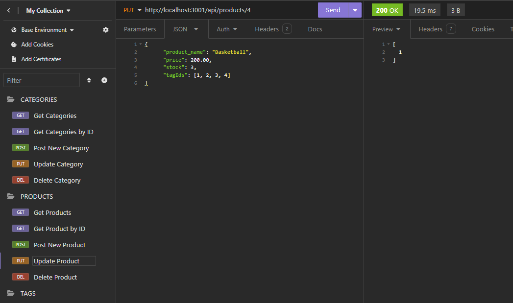

# E-commerce-Backend

## Overview
This back end system is designed to handle the data management tasks for an ecommerce platform. It employs ORM techniques to simplify interactions with the underlying database, allowing seamless operations for CRUD (Create, Read, Update, Delete) actions on various entities such as products, orders, users, and more.

## Table of Contents

  - [Features](#features)
  - [Video Walkthrough](#video-walkthrough)
  - [Screenshots](#screenshots)
  - [License](#license)

## Features

* GET requests allow the user to visualize all items in the specified tables.
* POST requests allow the user to add more information to the dabase tables.
* PUT requests allow the user to update the information already in the database tables.
* DELETE requestes allow the user to remove information from the database tables.

## Video Walkthrough

[Video Walkthrough](https://drive.google.com/file/d/1M7GJWb5O0Sf3dM_K-j6DUhSj3gZeAy6b/view)

## Screenshots

## License

MIT License